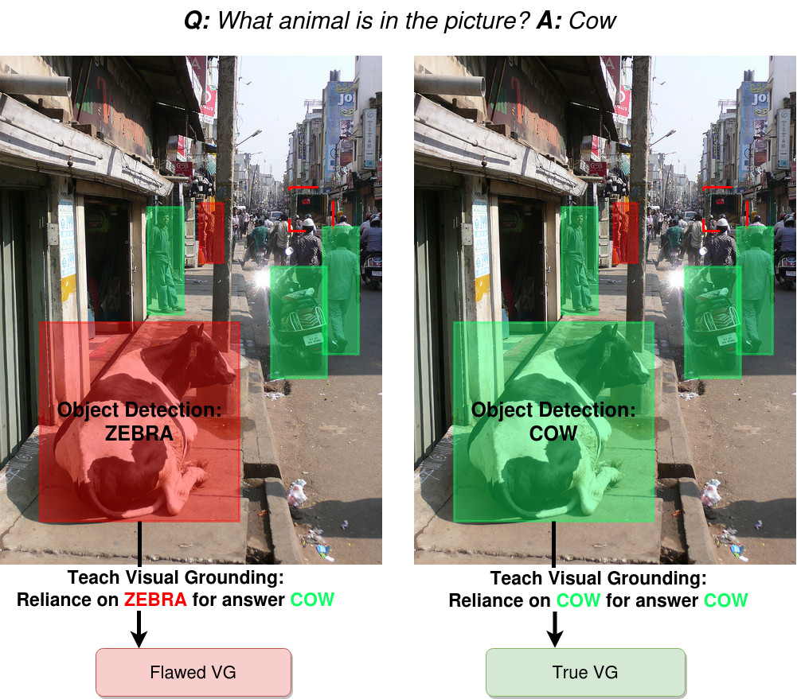

# True Visual Grounding

Repo for the paper [Uncovering the Full Potential of Visual Grounding Methods in VQA](https://arxiv.org/abs/2401.07803)
(Daniel Reich and Tanja Schultz)




## Setup
### Environment
Create and activate conda environment:
```bash
conda create -n truevg python=3.6
conda activate truevg
```
Install the dependencies with:
```bash
pip install -r requirements.txt
```
### Setup data and project directory
- Inside `scripts/common.sh`, edit `PROJ_DIR` variable by assigning it the project path.
- Most required data to run experiments from the paper can be downloaded manually here (setup scripts below will download files from there): https://zenodo.org/records/10357278

#### For GQA
Download data for GQA:
```bash
./scripts/download/download_truevg_gqa.sh
```
Preprocess the data:
```bash
./scripts/preprocessing/preprocessing_truevg_gqa.sh
```

#### For VQA-HAT
Download data for VQA-HAT (make sure to also use included files under files/ in this repo):
```bash
./scripts/download/download_truevg_vqa.sh
```

Preprocess the data:
```bash
./scripts/preprocessing/preprocessing_truevg_vqa.sh
```


## Training and Testing
- Run scripts in `scripts/GQA/`, and `scripts/VQAHAT/` to train models. Tests and evaluations run automatically after training. The first argument to these scripts is the dataset name (gqacp, hatcp), the second is your GPU's number. Example: 
```bash
./scripts/GQA/updn_baseline_DET.sh gqacp 0
./scripts/VQAHAT/updn_visFIS_INF_semantic.sh hatcp 1
```
Script names should be self-explanatory as to which model they train (in correspondence with the paper). Evaluation results (accuracy and FPVG) are printed after training and testing has finished.


## Acknowledgement
This code builds on [VisFIS](https://github.com/zfying/visfis), which itself used resources from [negative analysis of grounding](https://github.com/erobic/negative_analysis_of_grounding), [ramen](https://github.com/erobic/ramen), and [bottom-up-attention-vqa
](https://github.com/hengyuan-hu/bottom-up-attention-vqa). Code from [FPVG](https://github.com/dreichCSL/FPVG/) is also used.

## Citation

If you find this code useful for your research, please consider citing:
```
@inproceedings{reich2024truevg,
  title={Uncovering the Full Potential of Visual Grounding Methods in VQA},
  author = {Reich, Daniel and Schultz, Tanja},
  booktitle={arXiv},
  year={2024}
}
```
